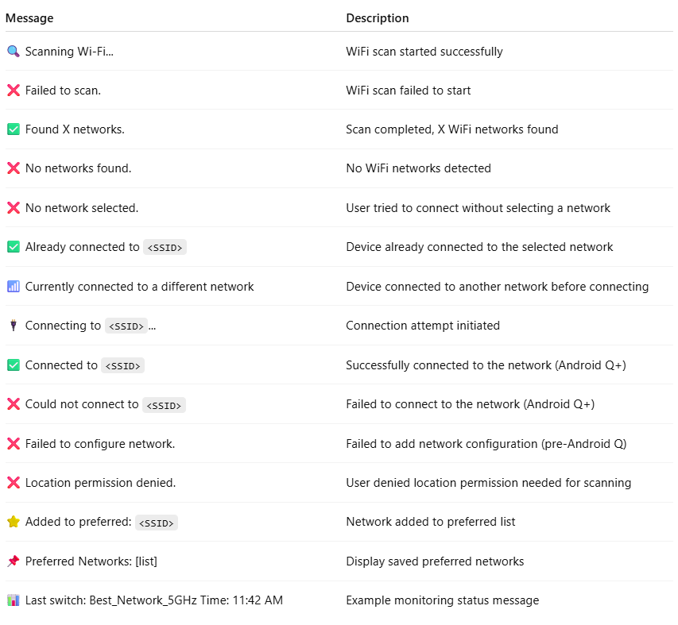
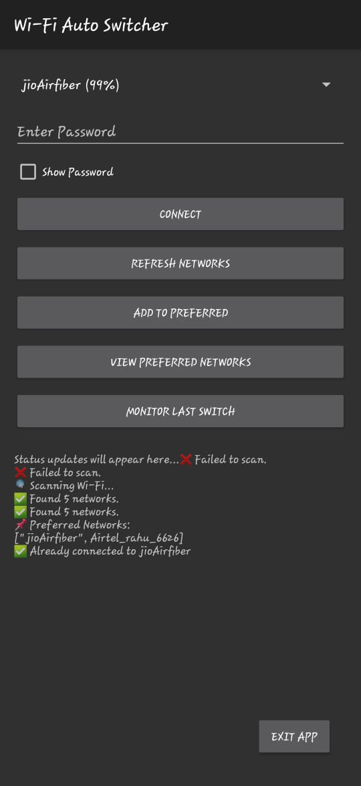
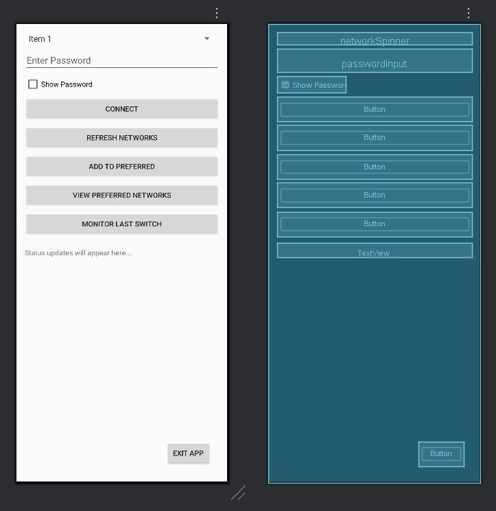

# WiFi Auto Switch Android App

An Android application that scans available WiFi networks, displays them in a dropdown, allows you to connect by entering passwords, and supports preferred networks management and auto-switching.

---

## Features

- Scan and list nearby WiFi networks
- Show WiFi signal strength (RSSI)
- Connect to selected WiFi network with password input
- Show/hide password toggle
- Add and view preferred networks saved locally
- Auto-refresh WiFi scan every 30 seconds
- Monitor last WiFi network switch status
- Supports Android 10+ (uses WifiNetworkSpecifier API) and older versions
- 

---

## Usage

1. Install the app on your Android device or run from Android Studio.
2. Grant location permission when prompted (required for WiFi scanning).
3. Tap **Refresh** to scan available WiFi networks.
4. Select a network from the dropdown list.
5. Enter the password for the network.
6. Use **Show Password** checkbox to toggle password visibility.
7. Tap **Connect** to connect to the selected network.
8. Add networks to preferred list with **Add Preferred**.
9. View preferred networks using **View Preferred**.
10. Monitor last switch with **Monitor Switch** button.

---

## Requirements

- Android device with Android 6.0 (API 23) or higher
- Location permission enabled (`ACCESS_FINE_LOCATION`)
- WiFi enabled on the device
- Android Studio (optional) for building from source

---

## Permissions

The app requires the following permissions:

- `ACCESS_FINE_LOCATION` — Needed to scan WiFi networks on Android 6.0+ due to location privacy policies.
- `ACCESS_WIFI_STATE` — To get information about WiFi networks.
- `CHANGE_WIFI_STATE` — To enable, disable, or connect to WiFi networks.
- `ACCESS_NETWORK_STATE` — To check the status of network connectivity.
- `CHANGE_NETWORK_STATE` — To change the state of network connectivity.
- `INTERNET` — To access the internet if needed.
- `WRITE_SETTINGS` — To modify system settings if required by the app.
  
---
## Installation

- Clone the repository  
  `git clone https://github.com/yourusername/WifiAutoSwitch.git`

- Open the project in Android Studio  
- Build and run on a connected Android device or emulator

---
## How to Build and Run

1. Clone the repository or download the source code.
2. Open the project in Android Studio.
3. Grant location permission when prompted on your device/emulator.
4. Run the app on your Android device or emulator.
5. Use the dropdown to select a WiFi network.
6. Enter the network password and connect.
7. Use buttons to refresh networks, add preferred networks, and monitor status.

---

## Notes

- Android 10+ uses the recommended `WifiNetworkSpecifier` API for connecting to WiFi.
- On older Android versions, the app uses `WifiConfiguration`.
- WiFi scanning requires location permission due to Android system restrictions.
- Preferred networks are saved in `SharedPreferences`.
- Auto-switch scans every 30 seconds to update available networks.

---

## Troubleshooting

- Make sure location services are enabled on your device.
- If WiFi scanning doesn’t work, check if location permission is granted.
- For Android 10+, the app cannot connect to networks programmatically if the device does not support the `WifiNetworkSpecifier` API.

---

